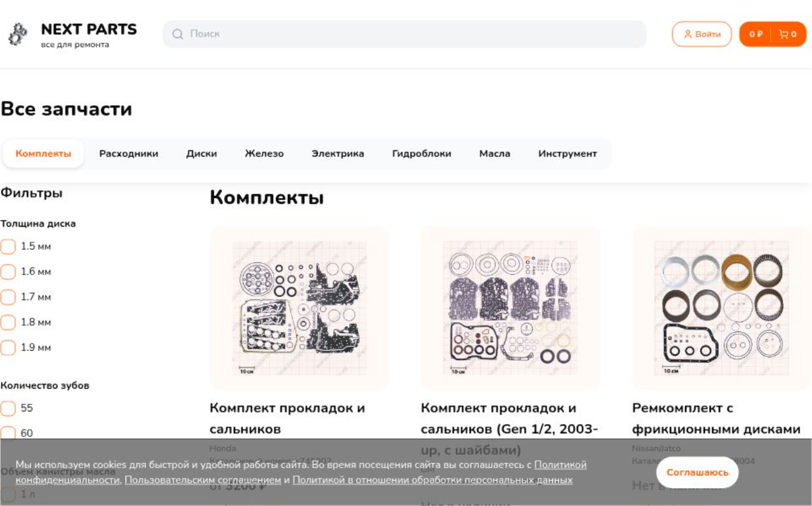

# NEXT-PARTS

## Это учебный проект интернет-магазина запчастей для автоматических трансмиссий

Проект построен в фреймворке NextJS v14. Рабочая версия размещена на Vercel https://next-parts.vercel.app  
Cтек:

- DB:
  - PostgreSQL
  - Prisma ORM
- State-менеджеры:
  - Redux-Toolkit (включая RTK-Query)
  - Zustand (для ознакомления с технологией)
- UI-компоненты:
  - Shadcn/UI
  - Lucide
  - React-hot-toast
  - Thiings collection https://www.thiings.co/things
- Библиотеки
  - React-hook-form
  - React-select
  - Zod валидация форм
  - Axios
  - Next-auth
  - Bcrypt
  - React-use (useSet, useIntersection, useDebounce)
- Сервисы
  - Resend для отправки email
  - React-DaData для автоподстановки адресов
- Стилизация через глобальный файл стилей и Tailwind
